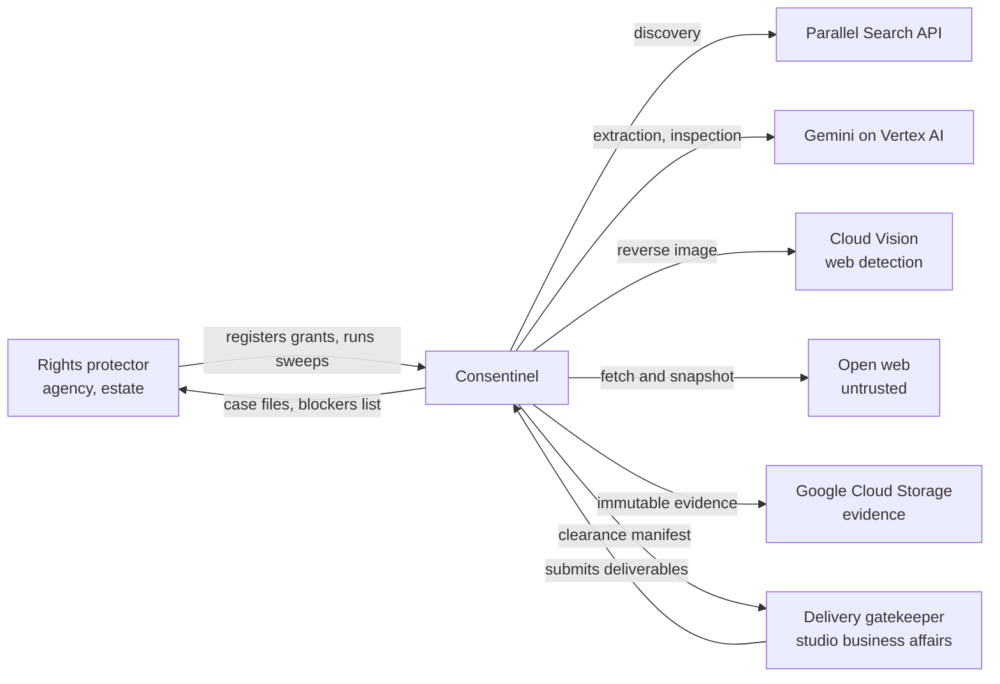
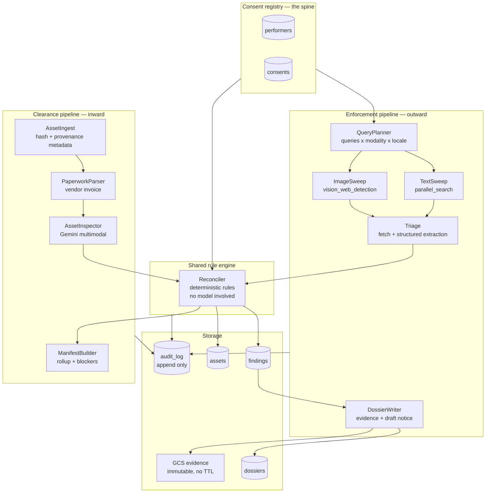
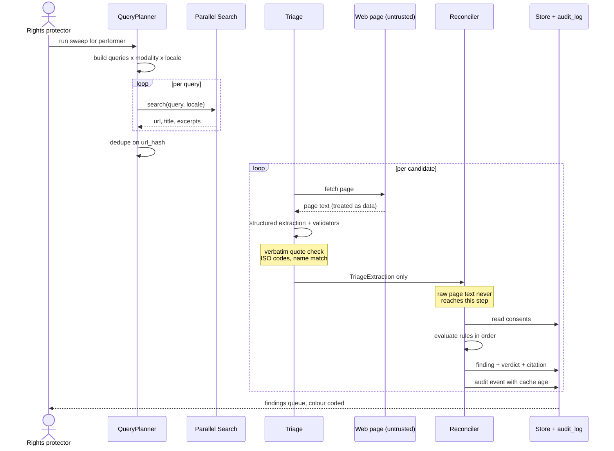
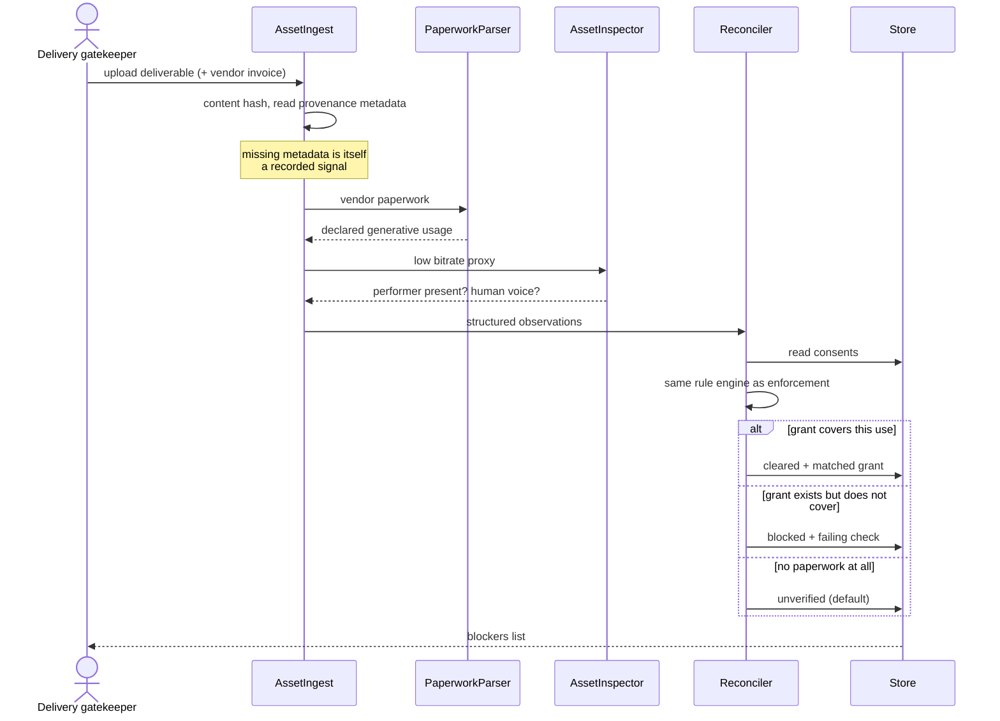
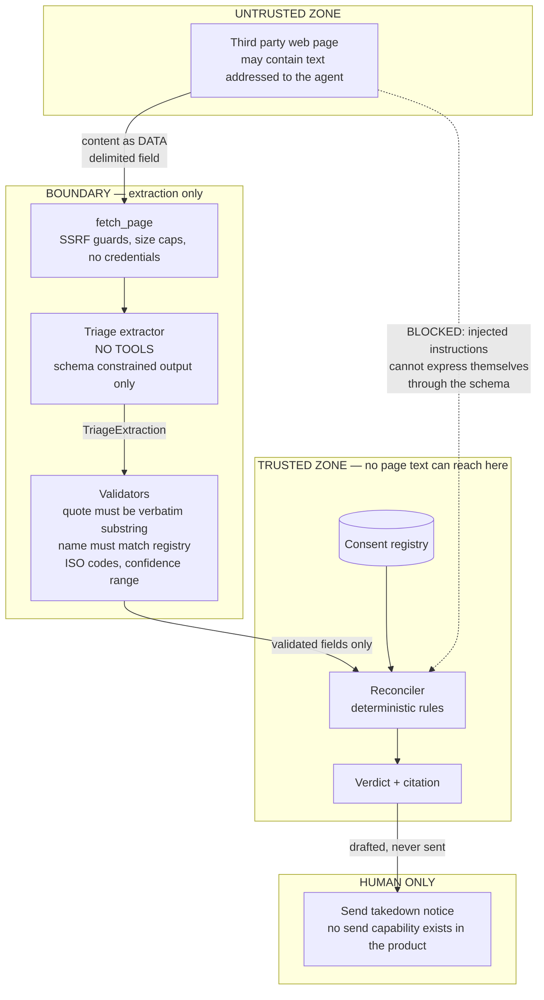
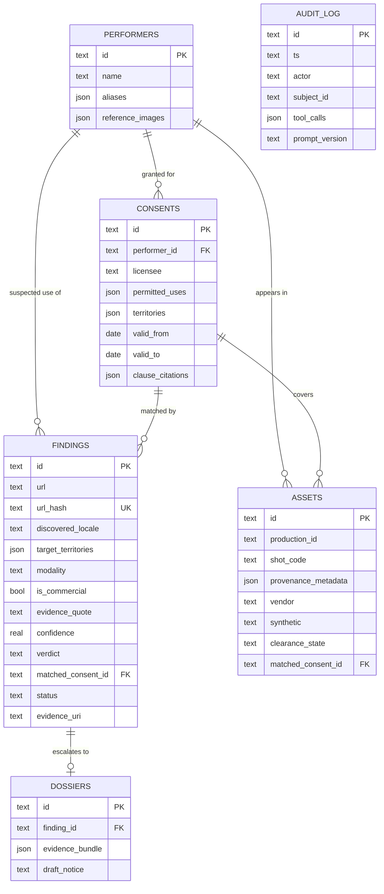
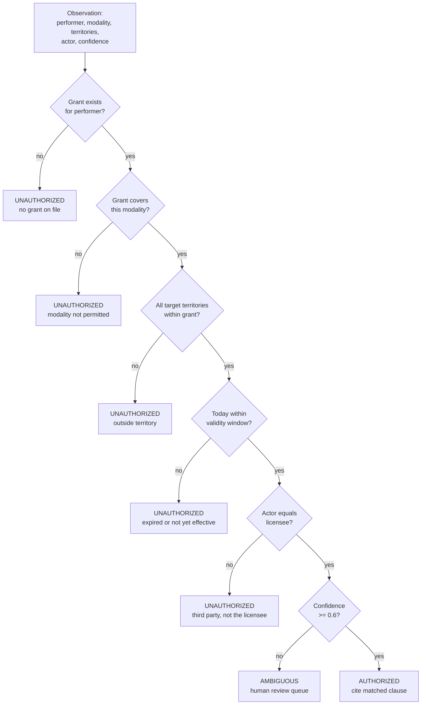

# Consentinel — architecture diagrams

Mermaid sources. These render natively in **Notion** (`/code` block → language `Mermaid`), in
GitHub, and in most wikis. Paste the fenced block contents, not the fence.

For the demo video, diagram 5 (trust boundary) is the most distinctive — most submissions won't
have one.

---

## 1. System context

Who talks to what.

---

## 2. Component architecture

The registry is the spine; two pipelines read from it in opposite directions and share one rule
engine.

---

## 3. Enforcement sequence

---

## 4. Clearance sequence

---

## 5. Trust boundary — the distinctive one

Where untrusted content enters, and where it is structurally prevented from reaching a decision.

---

## 6. Data model

---

## 7. Verdict rule flow

The decision logic, as deterministic code. Worth putting in Notion so everyone agrees on it before
it is implemented.

Note: any failure or exception anywhere in the pipeline resolves to **AMBIGUOUS** or **UNVERIFIED**,
never to AUTHORIZED or CLEARED. See `TECHNICAL_DESIGN.md` §0.
