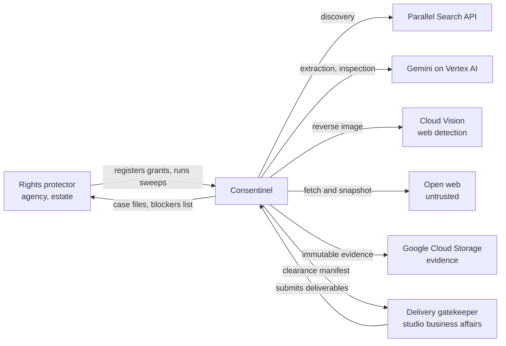
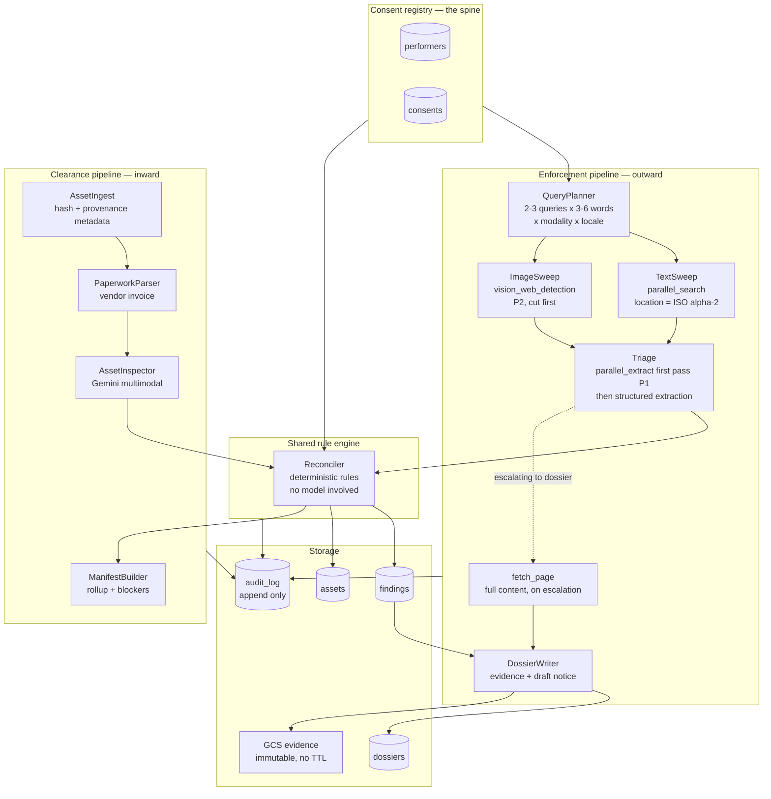
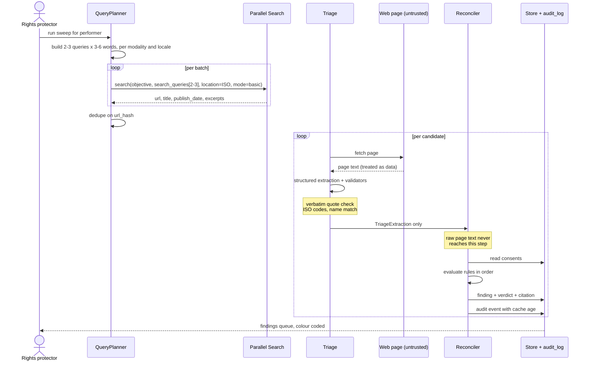
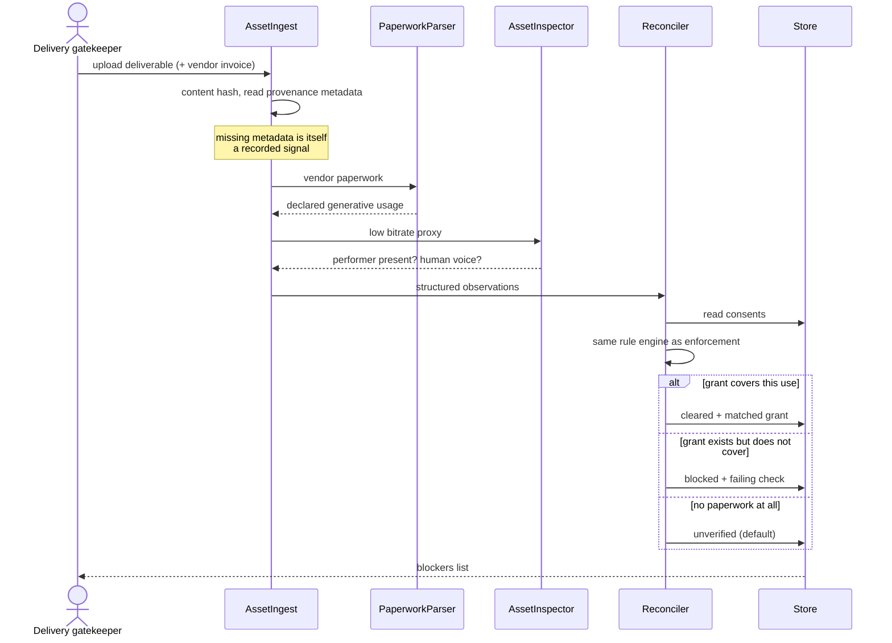
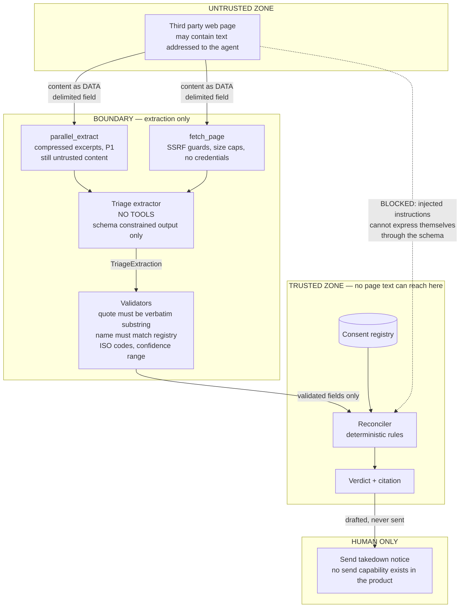
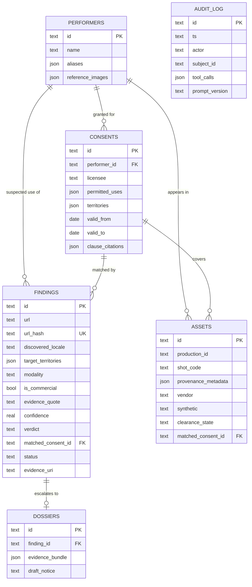
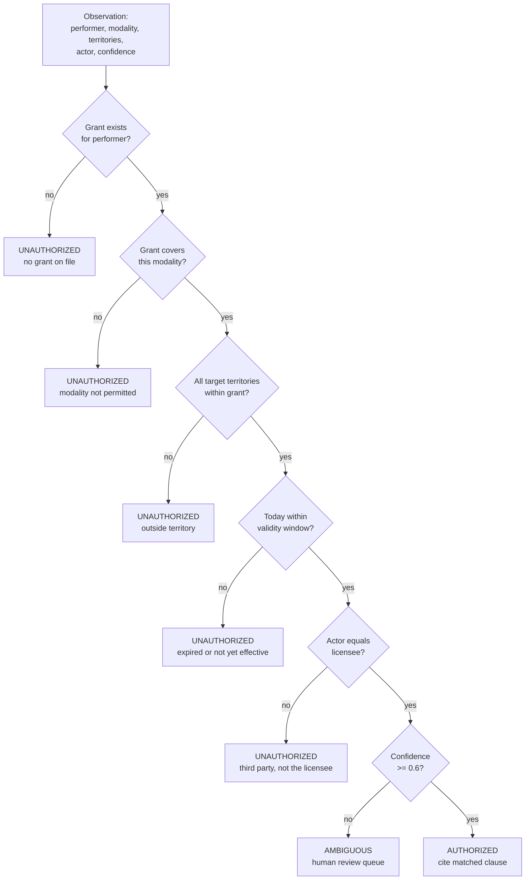
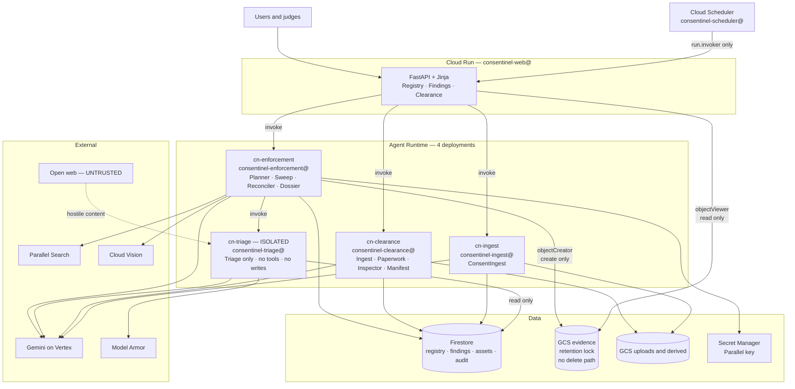
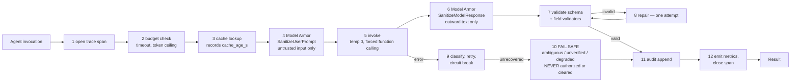

# Consentinel — architecture diagrams

**Status: 🔒 FROZEN at v1.0.0 (2026-09-07)** — approved by Prachit; Vedant and Swara to acknowledge.
Safe to design against. Structural changes from here need all three to agree and a MAJOR bump in
[VERSION.md](VERSION.md).

Runtime placement, IAM, the agent harness, Model Armor, observability and evaluation are in
[SYSTEM_DESIGN.md](SYSTEM_DESIGN.md). Diagrams 8 and 9 below cover deployment and the harness.

Mermaid sources. These render natively in **Notion** (`/code` block → language `Mermaid`), in
GitHub, and in most wikis. Paste the fenced block contents, not the fence.

For the demo video, diagram 5 (trust boundary) is the most distinctive — most submissions won't
have one.

## What the Parallel API research settled

Both blocking questions are answered (confirmed against docs.parallel.ai, 7 Sep 2026):

- **Locale is natively supported.** `location` takes an ISO 3166-1 alpha-2 country code, and queries
  may be written in any language with no extra configuration — 26+ languages, 30+ countries. Our
  `Locale(language, region)` maps directly: region → `location`, language → the language the query
  is written in.
- **Extract does *not* return full page content.** It returns compressed, objective-scoped excerpts.
  So it **cannot** replace `fetch_page` and **cannot** serve as evidence. `fetch_page` stays.
- Extract earns a place as an **optional cheap first-pass read** during triage, with `fetch_page`
  reserved for candidates escalating to a dossier. Fewer full fetches, more of the judged partner
  service at runtime. Marked P1 — if it's cut, nothing else changes.
- **No second partner product.** We are not adopting ClickHouse for v1, so OQ-2 no longer gates
  anything. SQLite behind the `Store` interface; ClickHouse stays a documented post-hackathon path.
- One contract consequence: `search_queries` takes **2–3 queries of 3–6 words each** per call, with
  an `objective`. `QueryPlanner` batches accordingly. See `tools/contracts.py`.

---

## 1. System context

Who talks to what.

---

## 2. Component architecture

The registry is the spine; two pipelines read from it in opposite directions and share one rule
engine.

---

## 3. Enforcement sequence

---

## 4. Clearance sequence

---

## 5. Trust boundary — the distinctive one

Where untrusted content enters, and where it is structurally prevented from reaching a decision.

---

## 6. Data model

---

## 7. Verdict rule flow

The decision logic, as deterministic code. Worth putting in Notion so everyone agrees on it before
it is implemented.

Note: any failure or exception anywhere in the pipeline resolves to **AMBIGUOUS** or **UNVERIFIED**,
never to AUTHORIZED or CLEARED. See `TECHNICAL_DESIGN.md` §0.

---

## 8. Deployment and trust zones

Four Agent Runtime deployments, six service accounts. Full IAM table in
[SYSTEM_DESIGN.md](SYSTEM_DESIGN.md) §3.

**The property to notice:** no principal holds `objectAdmin` on the evidence bucket. Combined with
retention lock and object versioning, **nothing in the system can delete evidence.** And Triage —
the only component touching attacker-controlled content — holds the weakest permissions of anything
here: no secrets, no storage, no database writes, no tools.

---

## 9. The agent harness

Every agent runs through one wrapper. Built once (WU-00), it is why the other ten agents are cheap.

Each agent declares a `HarnessPolicy` carrying its timeout, retry budget, output schema, cache
regime, Model Armor templates and **`tools` tuple**. That tuple is not documentation — the harness
refuses any tool call not named in it, which is how the trust boundary is enforced in code rather
than by convention. Triage declares `tools=()`.
